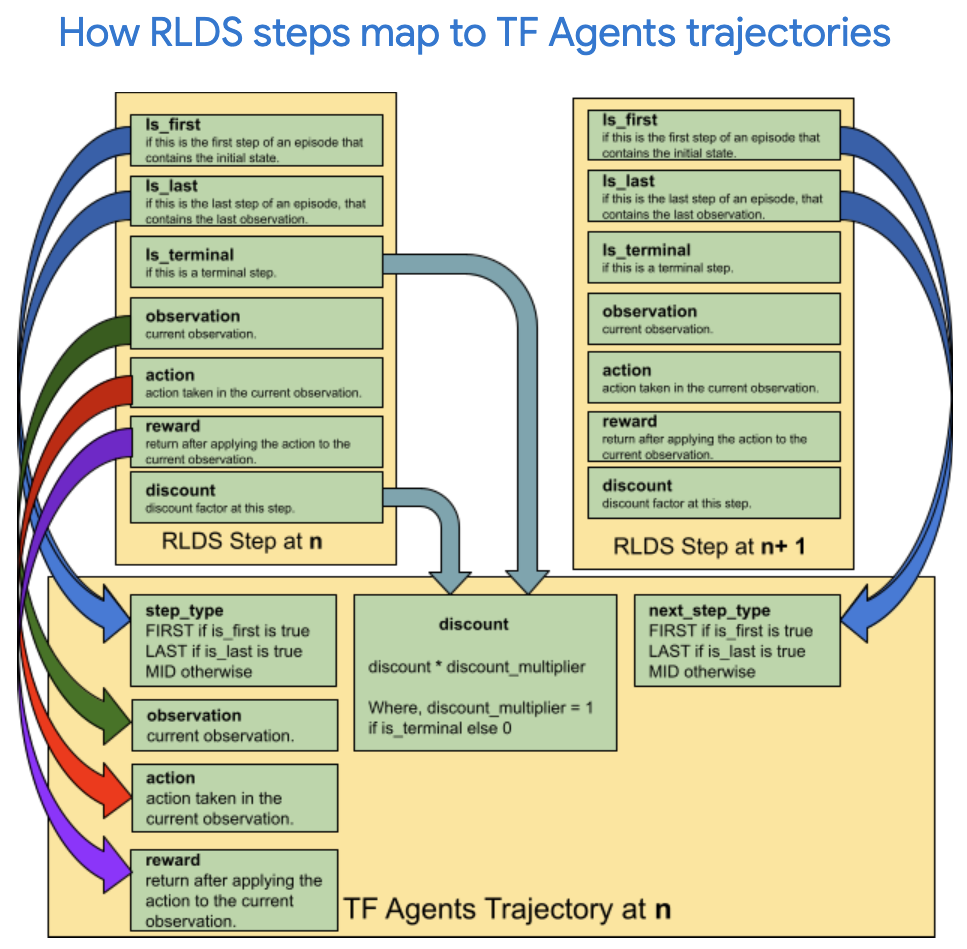
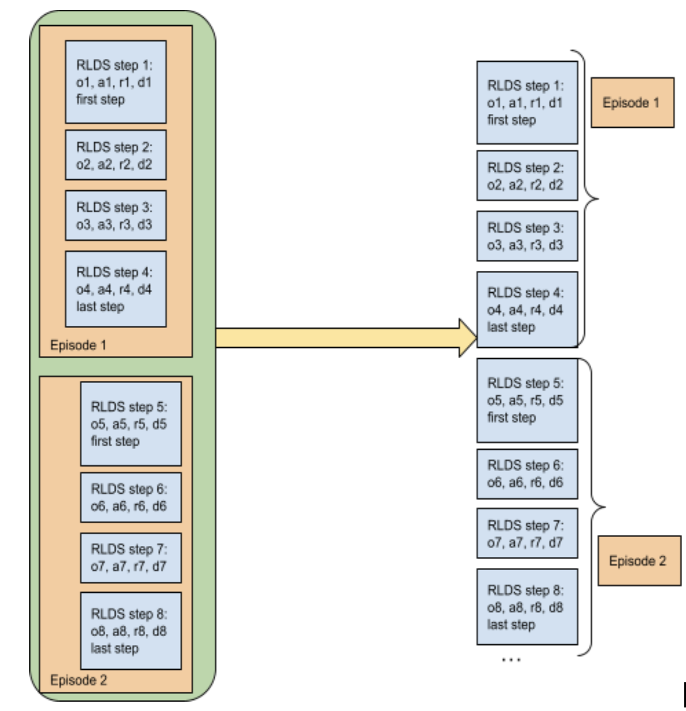
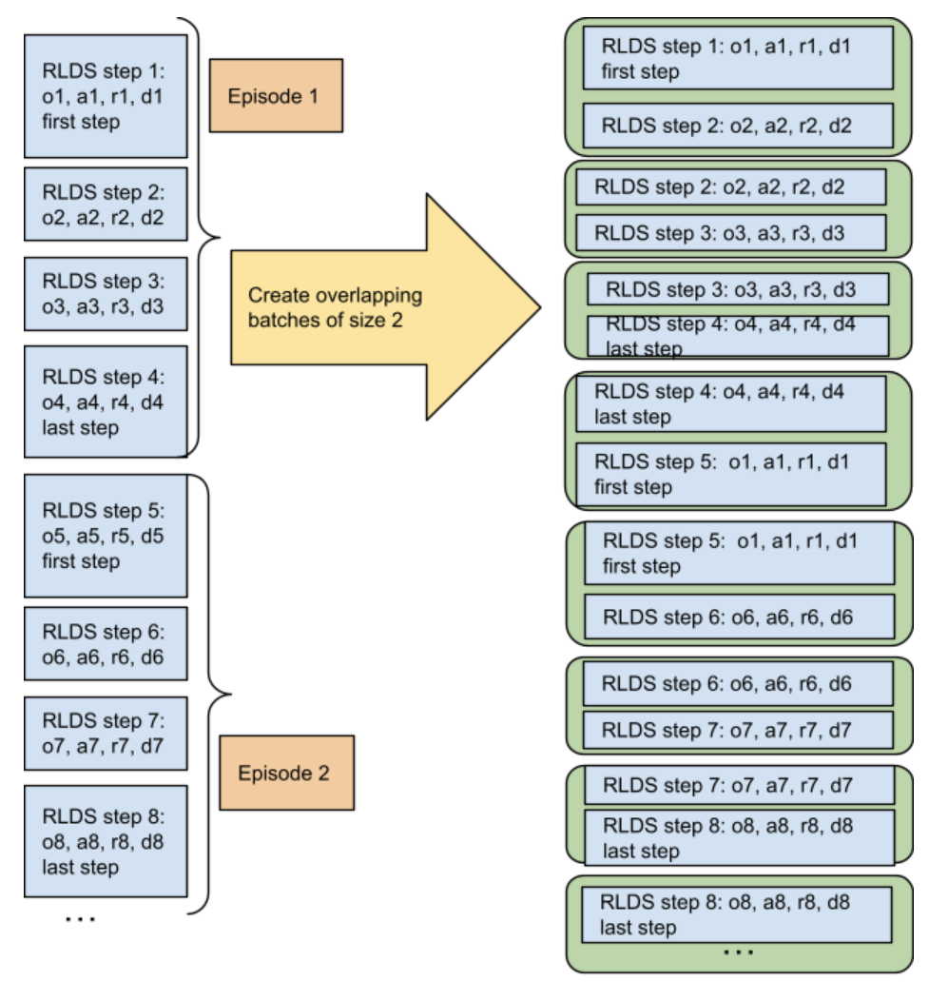
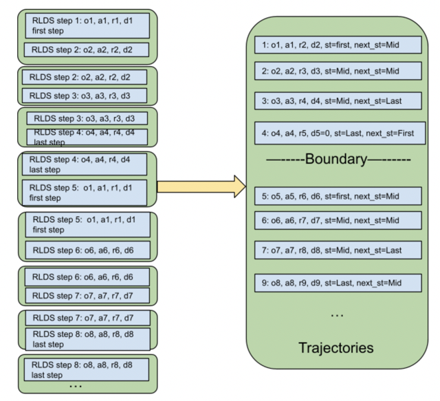

# RLDS to Reverb util in TF-Agents

[RLDS](https://github.com/google-research/rlds) to
[Reverb](https://github.com/deepmind/reverb) util is a tool in TF Agents to read
the episodes from RLDS, transform them into trajectories, and push them to
Reverb.

### RLDS Dataset

RLDS (Reinforcement Learning Datasets) is an ecosystem of tools to store,
retrieve and manipulate episodic data in the context of Sequential Decision
Making including Reinforcement Learning (RL), Learning from Demonstrations,
Offline RL or Imitation Learning.

Each step has the below fields (and sometimes, extra fields for step metadata).
As an example, we use the specs from the D4RL dataset
[half-cheetah/v0-expert](https://www.tensorflow.org/datasets/catalog/d4rl_mujoco_halfcheetah#d4rl_mujoco_halfcheetahv0-expert_default_config)


*   **'action'**: `TensorSpec(shape = (6,), dtype = tf.float32, name = None)`

*   **'discount'**: `TensorSpec(shape = (), dtype = tf.float32, name = None)`

*   **'is_first'**: `TensorSpec(shape = (), dtype = tf.bool, name = None)`

*   **'is_last'**: `TensorSpec(shape = (), dtype = tf.bool, name = None)`

*   **'is_terminal'**: `TensorSpec(shape = (), dtype = tf.bool, name = None)`

*   **'observation'**: `TensorSpec(shape = (17,), dtype = tf.float32, name =
    None)`

*   **'reward'**: `TensorSpec(shape = (), dtype = tf.float32, name = None)},
    TensorShape([]))`

## API of the RLDS to TF-Agents utils

### Create trajectory spec from a dataset

Creates data spec for initializing Reverb server and Reverb Replay Buffer.

```
def create_trajectory_data_spec(rlds_data: tf.data.Dataset) -> trajectory.Trajectory:
```

Creates the data spec for the corresponding trajectory dataset that can be
created using the `rlds_data` provided as input. This data spec is necessary for
initializing a Reverb server and Reverb Replay Buffer.

**Arguments**:

*   `rlds_data`: An RLDS dataset is a `tf.data.Dataset` of RLDS episodes, where
    each episode contains a `tf.data.Dataset` of RLDS steps and, optionally,
    episode metadata. An RLDS step is a dictionary of tensors containing
    `is_first`, `is_last`, `observation`, `action`, `reward`, `is_terminal`, and
    `discount` (and, sometimes, step metadata).

**Returns**:

*   A trajectory spec that that can be used to create a trajectory dataset with
    the `rlds_data` provided as input.

**Raises**:

*   `ValueError`: If no RLDS steps exist in `rlds_data`.

### Convert RLDS data to TF Agents trajectories

Converts the RLDS data to a dataset of trajectories. Currently, we only support
conversion to a two step trajectory.

```
def convert_rlds_to_trajectories(rlds_data: tf.data.Dataset,
    policy_info_fn: _PolicyFnType = None) -> tf.data.Dataset:
```

Converts the `rlds_data` provided to a dataset of TF Agents trajectories by
flattening and converting it into batches and then tuples of overlapping pairs
of adjacent RLDS steps.

The RLDS data is padded at the end with a step of type `first` to ensure that
the trajectory created using the last step of the last episode has a valid next
step type.

**Arguments**:

*   `rlds_data`: An RLDS dataset is `tf.data.Dataset` of RLDS episodes, where
    each episode contains a `tf.data.Dataset` of RLDS steps (and, optionally,
    episode metadata). An RLDS step is a dictionary of tensors containing
    `is_first`, `is_last`, `observation`, `action`, `reward`, `is_terminal`, and
    `discount` (and, optionally, step metadata).
*   `policy_info_fn`: An optional function to create some policy.info to be used
    while generating TF-Agents trajectories.

**Returns**:

*   A dataset of type `tf.data.Dataset`, elements of which are TF Agents
    trajectories corresponding to the RLDS steps provided in `rlds_data`.

**Raises**:

*   `ValueError`: If no RLDS steps exist in `rlds_data`.

*   `InvalidArgumentError`: If the RLDS dataset provided has episodes that:

    *   Incorrectly end i.e. does not end in the last step.
    *   Incorrectly terminate i.e. a terminal step is not the last step.
    *   Incorrectly begin i.e. a last step is not followed by the first step.
        Please note that the last step of the last episode is taken care of in
        the function and the user does not need to make sure that the last step
        of the last episode is followed by a first step.

### Push RLDS data to Reverb

Pushes the RLDS data to the Reverb server as TF Agents trajectories. Reverb
observer must be instantiated before calling the interface and provided as a
parameter.

```
def push_rlds_to_reverb(rlds_data: tf.data.Dataset, reverb_observer: Union[
    reverb_utils.ReverbAddEpisodeObserver,
    reverb_utils.ReverbAddTrajectoryObserver],
    policy_info_fn: _PolicyFnType = None) -> int:
```

Pushes the `rlds_data` provided to the Reverb server using `reverb_observer`
after converting it to TF Agents trajectories.

Please note that the data spec used to initialize replay buffer and reverb
server for creating the `reverb_observer` must match the data spec for
`rlds_data`.

**Arguments**:

*   `rlds_data`: An RLDS dataset is a `tf.data.Dataset` of RLDS
    episodes, where each episode contains a `tf.data.Dataset` of RLDS steps
    (and, optionally, episode metadata). An RLDS step is a dictionary of tensors
    containing `is_first`, `is_last`, `observation`, `action`, `reward`,
    `is_terminal`, and `discount` (and, optionally, step metadata).
*   `reverb_observer`: A Reverb observer for writing trajectories data to
    Reverb.
*   `policy_info_fn`: An optional function to create some policy.info to be used
    while generating TF-Agents trajectories.

**Returns**:

*   An `int` representing the number of trajectories successfully pushed to
    RLDS.

**Raises**:

*   `ValueError`: If no RLDS steps exist in `rlds_data`.

*   `ValueError`: If data spec used to initialize replay buffer and reverb
    server for creating the `reverb_observer` does not match the data spec for
    trajectory dataset that can be created using `rlds_data`.

*   `InvalidArgumentError`: If the RLDS dataset provided has episodes that are:

    *   Incorrectly end i.e. does not end in the last step.
    *   Incorrectly terminate i.e. a terminal step is not the last step.
    *   Incorrectly begin i.e. a last step is not followed by the first step.
        Please note that the last step of the last episode is taken care of in
        the function and the user does not need to make sure that the last step
        of the last episode is followed by a first step.

## How RLDS steps map to TF Agents trajectories

The following sequence are RLDS steps at timesteps t, t+1 and t+2. Each step
contains an observation (o), action (a), reward (r) and discount (d). The
elements of the same step are grouped in parenthesis.

```
(o_t, a_t, r_t, d_t), (o_t+1, a_t+1, r_t+1, d_t+1), (o_t+2, a_t+2, r_t+2, d_t+2)
```

In RLDS,

*   `o_t` corresponds to the observation at time t

*   `a_t` corresponds to the action at time t

*   `r_t` corresponds to the reward received for having performed action at at
    observation `o_t`

*   `d_t` corresponds to the discount applied to reward `r_t`

```
Step 1 =  o_0, a_0, r_0, d_0, is_first = true, is_last = false, is_terminal = false
```

```
Step 2 =  o_1, a_1, r_1,d_1, is_first = False, is_last = false, is_terminal = false
```

…

```
Step n =  o_t, a_t, r_t, d_t, is_first = False, is_last = false, is_terminal = false
```

```
Step n+1 =   o_t+1, a_t+1, r_t+1, d_t+1, is_first = False, is_last = true, is_terminal = false
```

When `is_terminal = True`, the observation corresponds to a final state, so
reward, discount and action are meaningless. Depending on the environment, the
final observation may also be meaningless.

If an episode ends in a step where `is_terminal = False`, it means that this
episode has been truncated. In this case, depending on the environment, the
action, reward and discount might be empty as well.



### Conversion Process

#### Flatten the dataset

RLDS dataset is a dataset of episodes that are in turn datasets of RLDS steps.
It is first flattened to dataset of steps.



#### Create overlapping pairs of adjacent steps

Flattened RLDS dataset is then batched and converted to a dataset of overlapping
pairs of adjacent RLDS steps.



#### Convert to TF-Agents trajectories

The dataset is then converted to TF-Agents trajectories.


